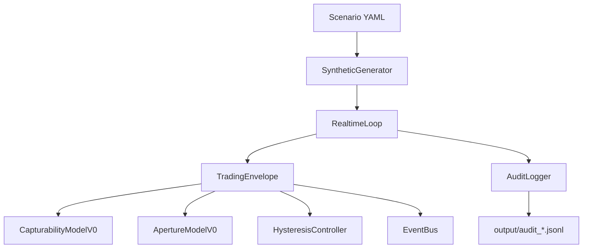

# D04 Physical Design v0.1

## 1. Purpose

Provide the first executable physical implementation of the Trading Envelope control boundary around an evolving Return Shape.

## 2. Logical-to-Physical Mapping

- Return Shape logical concept -> ReturnShape model
- Return Field / execution condition envelope -> EnvelopeContext model
- Capturability function -> CapturabilityModel interface and CapturabilityModelV0
- Adaptive aperture -> ApertureModel interface and ApertureModelV0
- Hysteresis and persistence -> HysteresisController
- Envelope lifecycle transitions -> TradingEnvelope + lifecycle mapping helpers

## 3. Physical Component Diagram

## 4. Project Structure

Located in d04_trading_envelope with models, envelope logic, runtime, inputs, CLI, scenarios, tests, and docs.

## 5. Domain Models

- ReturnShape
- EnvelopeContext
- CapturabilityResult
- EnvelopeEvaluation
- Event / OpportunityEvent
- Enum types for direction, state, events, continuation

## 6. Return Shape Lifecycle

A single return_shape_id persists across updates; version increments each update. Validation enforces bounded normalized metrics and structural correctness.

## 7. Envelope Context

EnvelopeContext captures synthetic normalized market/execution feasibility fields and eligibility state.

## 8. Capturability Plug-in Design

CapturabilityModel is a replaceable interface:

evaluate(return_shape, context) -> CapturabilityResult

V0 uses deterministic weighted scoring and reason codes.

## 9. Aperture Plug-in Design

ApertureModel is a replaceable interface:

update(capturability_score, current_state, prior_aperture) -> aperture

V0 uses configurable exponential smoothing.

## 10. State Machine

States: CLOSED, OPENING, OPEN, CLOSING.

Deterministic transitions enforced by hysteresis thresholds and persistence counters.

## 11. Hysteresis

Asymmetric thresholds with persistence windows prevent chatter:

- open_threshold > close_threshold
- open_persistence_observations and close_persistence_observations validated >= 1

## 12. Safety Overrides

The following conditions force immediate CLOSED and bypass ordinary close persistence:

- MARKET_INELIGIBLE
- DATA_INVALID
- SHAPE_EXPIRED

## 13. Event Model

Typed events include shape/context updates, capturability/aperture updates, state transitions, opportunity/continuation/exit signals, and safety events.

## 14. Event Bus

In-process publish/subscribe EventBus for logging and extension. No network middleware.

## 15. Runtime Loop

RealtimeLoop processes each observation in order:

1. process shape+context through TradingEnvelope
2. publish emitted events
3. write audit record
4. render compact console output
5. sleep by scenario delta/speed (or no sleep at speed 0)

## 16. Synthetic Generator

SyntheticGenerator loads deterministic YAML steps and returns typed observation sequences with reproducible checksum.

## 17. Scenario Design

Six scenario files validate key envelope behaviors:

- strong shape / poor capture
- shape becomes capturable
- open then deterioration
- shape up / envelope down
- threshold noise hysteresis
- envelope up / shape down

## 18. Audit Logging

One JSONL record per observation with sequence, time, shape/context snapshots, components, aperture/state transition, signals, events, and reason codes.

## 19. Configuration

default.yaml defines:

- EXPERIMENTAL_V0_WEIGHTS
- aperture alpha
- hysteresis thresholds and persistence
- runtime defaults
- safety threshold

Validated on load with Pydantic models.

## 20. Testing

pytest suite includes validation, model range checks, hysteresis behavior, state-machine behavior, scenario acceptance, and audit integrity.

## 21. Determinism

Replay with speed 0 is deterministic for events, states, transitions, and capturability values (excluding wall-clock timestamps).

## 22. Performance

Includes 10,000-observation benchmark mode via CLI run-all summary.

## 23. Current Limitations

- Placeholder scoring math
- No broker or execution integration
- No learned adaptive model
- No historical/live market source

## 24. Replacement Points for Future Components

- SyntheticGenerator -> Market Data / Forward State source
- CapturabilityModelV0 -> learned/validated Capturability model
- ApertureModelV0 -> future validated aperture model
- logical position_open flag -> Position Lifecycle Manager
- console opportunity event -> Decision Engine
- synthetic execution context -> Execution Policy + Broker Adapter

## 25. Path to SPY / Alpaca Integration

Next physical step is historical SPY replay adapter feeding ReturnShape+EnvelopeContext.
Broker integrations remain disabled in v0.1 and should only be introduced after D04 replay validation, with strict interface boundaries to keep deterministic testing intact.

## Capturability Feasibility-Gate Upgrade - v0.2 (2026-08-11)

Why weighted compensation alone is insufficient:

- A very strong Return Shape can numerically offset poor execution environment values in a pure weighted average.
- This can produce misleadingly high capturability when the trade is operationally uncapturable.

Updated conceptual form:

- C_i(t) = B_i(t) * G_i(t)

Definitions:

- B_i(t): base capturability from Return Shape component, soft envelope component, and lifetime component.
- G_i(t): feasibility gate representing realizability under current Trading Envelope constraints.

Current v0.2 gate design:

- G_i(t) is minimum-based across configured feasibility dimensions.
- This is conservative by design; one hard bottleneck can dominate feasibility.
- The mode is currently fixed to minimum for deterministic interpretability.

Why this remains experimental:

- Both B_i and G_i definitions are scaffolding for later validated mathematics.
- Thresholds and dimensions are configurable and intended for controlled iteration.

Relationship to Trading Envelope Capturability definition:

- Capturability is treated as realizability, not merely weighted attractiveness.
- Strong shape does not override physically or operationally blocking envelope constraints.
