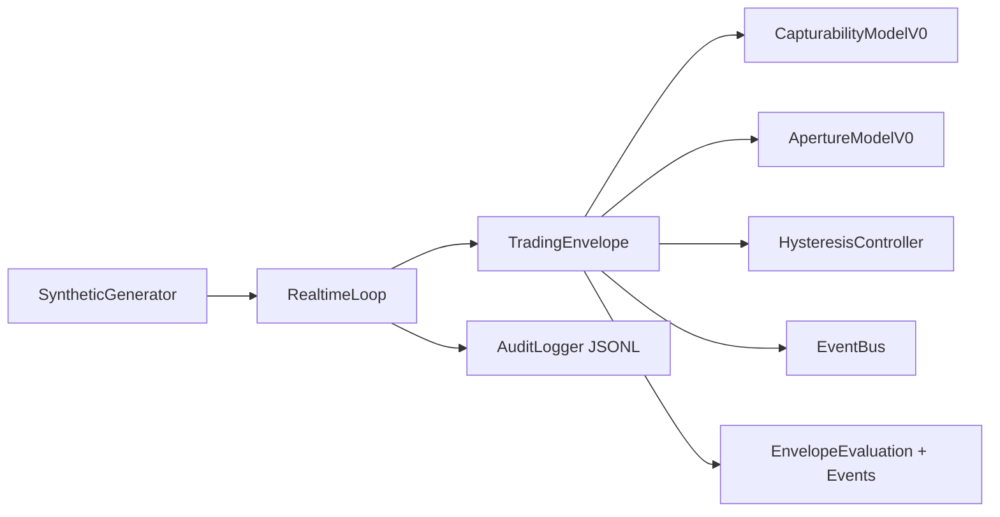

# APTF D04 Trading Envelope Physical Prototype v0.1

## Purpose

This project implements the first executable physical prototype of the APTF D04 Trading Envelope.
It validates envelope behavior around evolving Return Shape entities in deterministic synthetic real-time scenarios.

This prototype is for control-boundary validation only.

## Relationship to D04 Logical Design

The implementation preserves the required causal chain:

ReturnShape(t) <-> TradingEnvelope(t) -> Capturability(t) -> Adaptive Aperture -> Opportunity/Hold/Reduce/Exit signals.

Both Return Shape and Trading Envelope are elastic and evolving.

## What This Prototype Does

- Builds evolving Return Shape entities with stable return_shape_id and increasing version.
- Builds evolving EnvelopeContext entities.
- Evaluates deterministic placeholder capturability with a feasibility gate default in v0.2.
- Updates adaptive aperture with configurable smoothing.
- Applies hysteresis + persistence state transitions.
- Emits typed state/opportunity/continuation events.
- Applies safety overrides for market ineligible, data invalid, and shape expired.
- Writes one JSONL audit record per observation.
- Replays six deterministic synthetic scenarios at configurable speed.
- Supports deterministic replay checksum/event summaries.

## What This Prototype Does Not Do

- No Alpaca integration.
- No Interactive Brokers integration.
- No TradingView integration.
- No order placement, live or paper.
- No external API calls.
- No GUI/TUI app.
- No ML training.
- No final validated production mathematics.

## Architecture Diagram



## Project Structure

- config/: default and scenario catalog config
- scenarios/: deterministic scenario step files
- src/aptf_d04/models: validated domain models
- src/aptf_d04/envelope: capturability, aperture, hysteresis, lifecycle, trading envelope
- src/aptf_d04/runtime: event bus, realtime loop, audit logger
- src/aptf_d04/inputs: scenario loader and deterministic generator
- src/aptf_d04/cli: command line entrypoints
- tests/: pytest validation and acceptance checks
- output/: audit JSONL outputs

## Core Entities

- ReturnShape: evolving candidate signal shape
- EnvelopeContext: synthetic execution/environment quality vector
- CapturabilityResult: shape/envelope/lifetime components and score
- EnvelopeEvaluation: state transition, aperture update, events, reason codes

## State Machine

- CLOSED -> OPENING when open threshold condition first qualifies
- OPENING -> OPEN when open persistence is satisfied
- OPENING -> CLOSED if qualification disappears
- OPEN -> CLOSING when close threshold reached
- CLOSING -> CLOSED when close persistence is satisfied
- CLOSING -> OPEN if conditions recover

## Capturability Models

Design principle:

> A strong Return Shape cannot compensate for a Trading Envelope condition
> that makes the shape physically or operationally uncapturable.

> Capturability is not merely a weighted attractiveness score. It represents
> the realizability of a Return Shape under the active Trading Envelope.

### V0 (comparison baseline)

CapturabilityModelV0 is deterministic and transparent placeholder logic.

- shape_component: weighted normalized shape metrics
- envelope_component: weighted normalized context metrics
- lifetime_component: min(expected_lifetime_seconds / target_lifetime_seconds, 1)
- final score: ((shape_component + envelope_component) / 2) * lifetime_component

Safety conditions market ineligible or shape expired force score to 0.

Weights are defined as EXPERIMENTAL_V0_WEIGHTS in config.

### V0_2 (default)

CapturabilityModelV0_2 separates base score and feasibility gate:

- base_capturability_score = ((shape_component + envelope_component) / 2) * lifetime_component
- feasibility_gate_score = minimum(configured gate dimensions)
- capturability_score = base_capturability_score * feasibility_gate_score

This minimum gate is intentionally conservative and labeled EXPERIMENTAL_V0_2.

Default gate dimensions:

- liquidity_quality
- spread_quality
- latency_quality
- execution_feasibility
- capital_available
- portfolio_capacity
- position_capacity
- risk_capacity
- broker_health
- data_integrity

Example outcome:

Very strong Return Shape with poor liquidity/spread/execution feasibility produces
a low feasibility gate, low final capturability, and keeps the envelope CLOSED.

## ApertureModelV0

Aperture tracks capturability with exponential smoothing:

new_aperture = alpha * capturability + (1 - alpha) * prior_aperture

Aperture is clamped to [0, 1].

## Hysteresis Behavior

Uses asymmetric thresholds and persistence counts:

- open_threshold = 0.75
- close_threshold = 0.55
- open_persistence_observations = 3
- close_persistence_observations = 2

This suppresses threshold chatter around boundaries.

## Safety Overrides

Immediate safety-close behavior bypassing close persistence:

- MARKET_INELIGIBLE
- DATA_INVALID (data_integrity <= critical threshold)
- SHAPE_EXPIRED (inactive shape or non-positive lifetime)

## Install

```bash
python -m venv .venv
.venv\Scripts\activate
pip install -r requirements.txt
pip install -e .
```

## Run One Scenario

```bash
python -m aptf_d04.cli.main run-scenario 02_shape_becomes_capturable --speed 10 --verbose
```

## Run All Scenarios

```bash
python -m aptf_d04.cli.main run-all --speed 0
```

## Run Tests

```bash
pytest -q
```

## Example Console Output

```text
[2.0s] TEST_B RS-002 v3 shape=0.79 capture=0.77 aperture=0.58 state=OPENING->OPEN events=...QUALIFIED_OPPORTUNITY...
```

## Audit Log

Per-scenario output:

output/audit_<scenario_name>.jsonl

Each line contains sequence, shape/context snapshots, capturability components, state/aperture transition, emitted events, and reason codes.

## Known Limitations

- Capturability and aperture math are placeholders.
- Position lifecycle is logical-only (position_open boolean).
- No external market source.
- No production execution policy or broker adapter.

## Next Step

D04 historical replay / SPY integration as a replacement for synthetic generator inputs.
